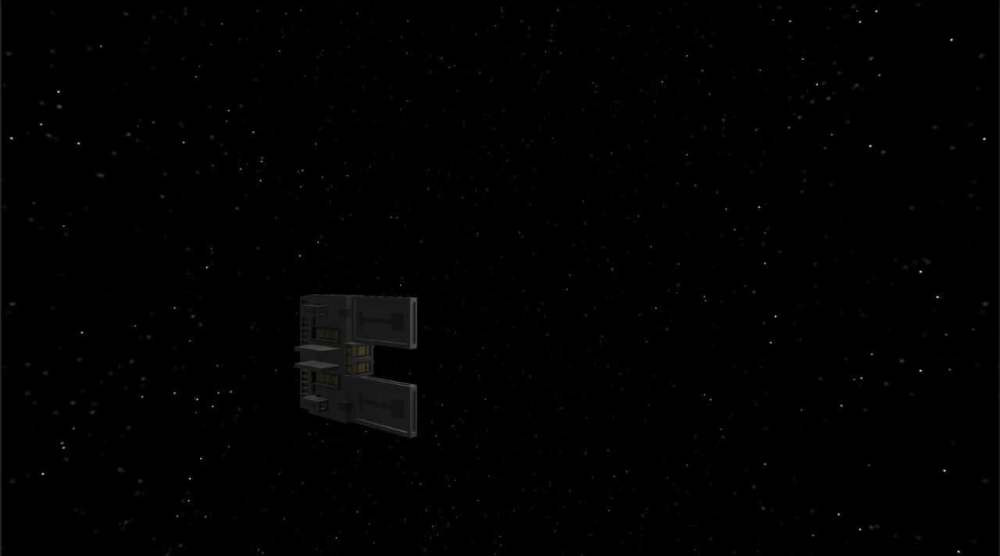

# TerrorPlanet

Terror Planet is a game in which you need to destroy planets and ships, improving your ship and buying new weapons. Version 0.1 was created by me in a month. If you dish - this is my first game that you can play. 

 Last project (The Rebels) I abandoned because of a lack of knowledge oop, and I would have done it for a very long time. 

<h2>The essence of the game </h2>

 The goal of the game is to destroy all planets and ships. Naturally, it's just that no one will let you do it, and you will have to improve your space ship (or change it) and buy more powerful weapons. 

<h2>What is available now?</h2>

The game needs to be completed and supplemented for a long time, both technically and gameplay. But in the game you can already: 

<ul> 
  <li> Destroy planets and ships </li>
  <li> Acquire weapons </li>
  <li> Customize the generated space </li>

</ul>
<h2> Roadmap: </h2>

 In the future, I'm going to make the game more interesting and beautiful. In the near future plans: 

<ul>
  <li>Buying ships</li>
  <li>Attacking AI ships </li>
  <li>A more advanced system for creating generated space. So far, it's just creating planets at random points, but later I'll add more celestial bodies.</li> 
</ul>
